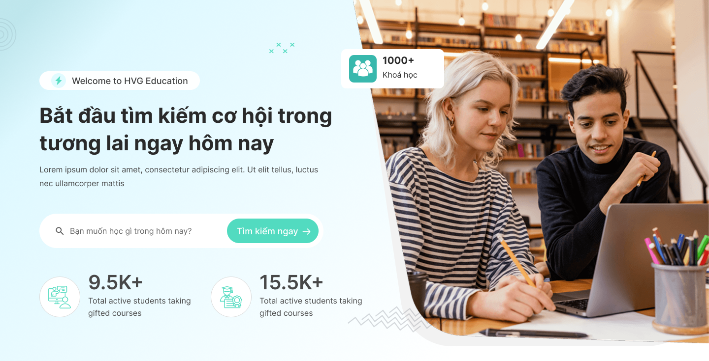

# Hvedu WordPress Themes Collection

Chào mừng bạn đến với bộ sưu tập các giao diện WordPress chất lượng cao được thiết kế riêng cho **HVG Education**. Repository này chứa hai phiên bản giao diện (Hvedu2 và Hvedu3) đã được chuyển đổi từ bản thiết kế Figma sang WordPress Theme hoàn chỉnh.

---

## Tổng quan các Theme

### 1. Hvedu2 Theme
Giao diện tập trung vào sự chuyên nghiệp, hiện đại với bố cục rõ ràng, phù hợp cho các trang giáo dục doanh nghiệp.


### 2. Hvedu3 Theme
Phiên bản cải tiến với phong cách trẻ trung hơn, sử dụng các hình khối sáng tạo và màu sắc bắt mắt.



---

## Tính năng nổi bật

- **Dynamic Navigation**: Hệ thống Menu động, quản lý dễ dàng 100% trong trang quản trị WordPress (Appearance > Menus).
- **Responsive Design**: Tương thích hoàn hảo với mọi thiết bị từ Mobile, Tablet đến Desktop nhờ Bootstrap 5.
- **Custom Page Templates**: Cung cấp các mẫu trang riêng biệt như Trang chủ (Backup), Trang giới thiệu, giúp linh hoạt trong việc xây dựng nội dung.
- **Asset Optimization**: Tất cả hình ảnh được tối ưu hóa, đường dẫn linh hoạt bằng các hàm core của WordPress.
- **Interactive Elements**: Tích hợp các hiệu ứng cuộn, slider khoá học và indicator navbar mượt mà bằng JavaScript.
- **Hệ thống Template Chuẩn**: Hỗ trợ đầy đủ các giao diện phân tách rõ ràng cho Trang tĩnh (Page) và Bài viết (Post), tuân thủ WordPress Template Hierarchy.

---

## Cấu trúc thư mục và Giải thích các file

Mỗi theme (Hvedu2 và Hvedu3) đều bao gồm các file lõi sau đây. Việc phân chia này giúp mã nguồn dễ đọc và dễ bảo trì hơn:

### Các file cốt lõi (Core Files)
- **header.php**: Chứa phần đầu của trang web (thẻ head, khai báo meta, thư viện) và thanh điều hướng Navbar. Được gọi ở mọi trang thông qua hàm get_header().
- **footer.php**: Chứa phần chân trang (chứa thông tin liên hệ, form đăng ký, copyright). Được gọi ở mọi trang thông qua hàm get_footer().
- **functions.php**: File chứa các cấu hình logic của theme, như việc đăng ký Menu (Theme Location), khởi tạo các trang mặc định khi kích hoạt theme, và tuỳ biến các hàm cốt lõi của WordPress.
- **style.css**: File bắt buộc của WordPress chứa thông tin khai báo Theme (Tên theme, Tác giả, Phiên bản) và các quy tắc CSS nếu cần.

### Các file giao diện (Template Files)
- **page.php**: Chịu trách nhiệm hiển thị giao diện cho các Trang tĩnh (Static Page) như "Giới thiệu", "Liên hệ". Cấu trúc được tối ưu cho việc đọc với nội dung căn giữa và chiều rộng giới hạn, không có sidebar.
- **single.php**: Chịu trách nhiệm hiển thị giao diện chi tiết của một Bài viết (Post). File này in ra đầy đủ tiêu đề, nội dung, ảnh đại diện, thông tin ngày đăng, tác giả, chuyên mục và thẻ (tags) của bài viết đó.
- **archive.php**: Chịu trách nhiệm hiển thị danh sách các bài viết khi người dùng truy cập vào một Chuyên mục (Category), Thẻ (Tag), hoặc Tác giả cụ thể. Được thiết kế dưới dạng lưới (Grid) hiển thị thẻ bài viết kèm theo phân trang.
- **index.php**: File dự phòng cuối cùng (Fallback) của hệ thống WordPress. Nếu website không tìm thấy các file template cụ thể hơn, nó sẽ sử dụng file này. Trong dự án này, index.php được thiết kế giống với archive.php để đóng vai trò làm trang danh sách Blog chính (Posts Page).
- **front-page-backup.php / page-introduce.php**: Các mẫu trang tùy biến (Custom Page Templates) dành riêng cho cấu trúc của trang chủ hoặc trang giới thiệu đặc thù.

---

## Hướng dẫn cài đặt

1. **Clone repository** về máy của bạn:
   ```bash
   git clone https://github.com/n1ml3/Hvedu-ThemeReadyForWordPress.git
   ```
2. **Copy thư mục theme** bạn muốn sử dụng vào thư mục `wp-content/themes/` của website WordPress của bạn.
3. **Kích hoạt Theme**: Vào trang quản trị WordPress > Appearance > Themes và nhấn **Activate** giao diện Hvedu.
4. **Thiết lập Menu**:
   - Vào Appearance > Menus.
   - Tạo menu mới và tích chọn vị trí **"Primary Menu"** để hiển thị trên Navbar.
5. **Thiết lập Blog (Post Page)**:
   - Vào Cài đặt (Settings) > Đọc (Reading).
   - Ở mục Bố cục trang chủ (Your homepage displays), chọn "Một trang tĩnh" (A static page).
   - Ở phần "Trang bài viết" (Posts page), chọn trang bạn muốn làm Blog (ví dụ: Tin tức).
   - Nhấn Lưu thay đổi.

---

## Công nghệ sử dụng

- **Core**: WordPress CMS, PHP 8.x
- **Frontend**: Bootstrap 5, Vanilla CSS, JavaScript (ES6+)
- **Tools**: Docker (cho môi trường phát triển)

---

## Ghi chú
Dự án được thực hiện với tiêu chí: *"Readability and Order > Speed and Complex Interconnections"*. Mã nguồn sạch, dễ bảo trì và mở rộng cho các doanh nghiệp giáo dục.

---
*Phát triển bởi n1ml3 cho HVG Education.*
